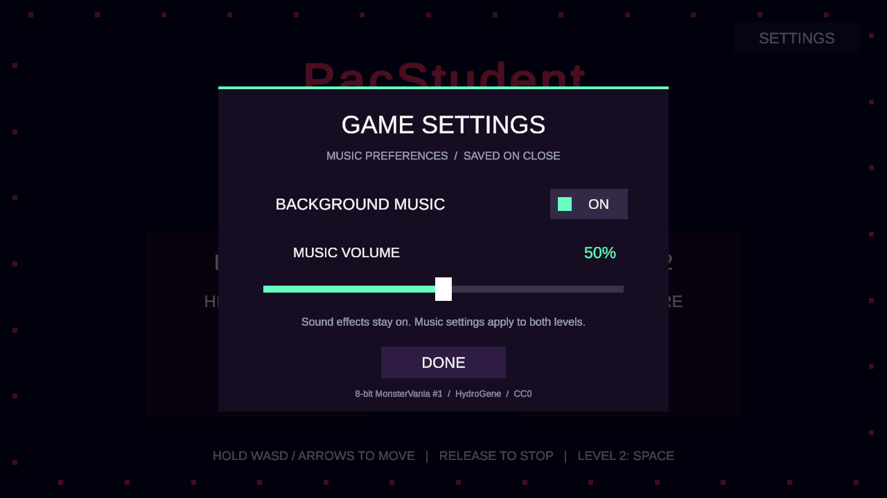
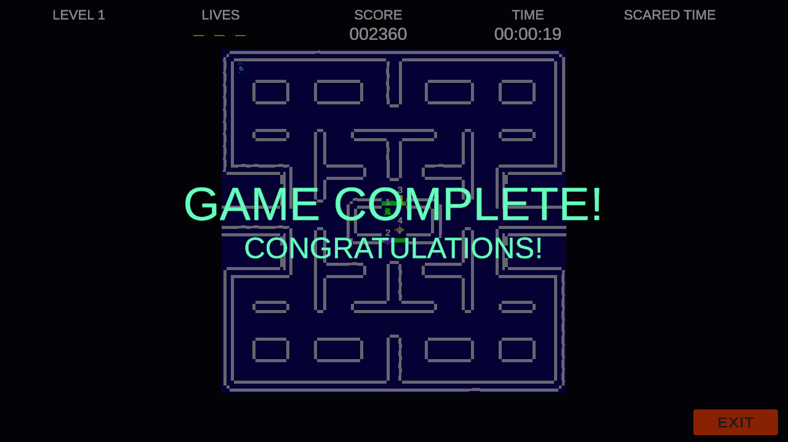
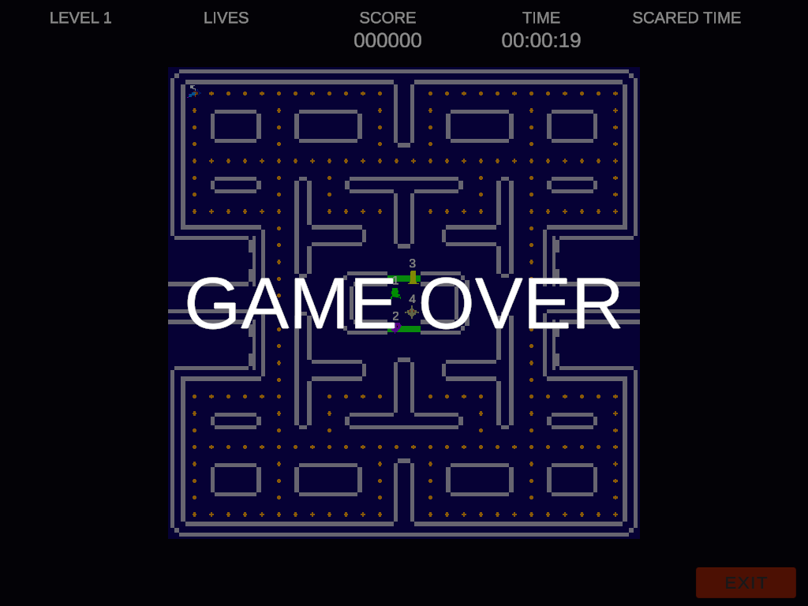

# PacStudent — Assessment 4

一款使用 Unity 制作的 2D 迷宫吃豆游戏。清空地图中的豆子、躲避四只行为不同的幽灵，并在第二关利用能量脉冲创造逃生和得分机会。

本项目由原来的 Pacstudent_Assess3 继续开发，当前版本已更新到 Assessment 4，并包含按住移动、可区分的受惊幽灵和独立通关提示。

## 下载与玩法

- **[点击在线试玩](https://leoz-svg.github.io/PacStudent/)**：使用带键盘的电脑打开，点击加载游戏即可体验。

- **[下载 Windows 游戏](https://github.com/leoz-svg/PacStudent/releases/latest)**：进入发布页，下载 `PacStudent-Windows.zip`，完整解压后运行 `PacStudent.exe`。无需安装 Unity。
- **[详细游戏玩法说明](docs/GAMEPLAY.zh-CN.md)**：包含操作、计分、幽灵行为、关卡机制和常见问题。
- **[源码和实现说明](README_COMPLETION.md)**：适合在 Unity 中打开和继续开发。

提供 Windows 64 位下载版和 WebGL 浏览器版。网页发布文件位于 docs/，需要通过 HTTP/HTTPS 访问；不要双击 HTML 直接打开。

## 最新版实机画面

以下截图来自 Unity Play Mode 的自动验证。

### 音乐设置（v1.1.0）

主菜单右上角 SETTINGS 可开关音乐并实时调节 0%～100% 音量，DONE / Esc 关闭后保存，两个关卡统一生效。游戏音效独立保留。新主旋律为 HydroGene 的 **8-bit MonsterVania #1**；[来源与 CC0 许可](THIRD_PARTY_NOTICES.md)。

### 四种受惊幽灵

幽灵保留各自外形，编号旁的 `!` 表示可以捕捉；恢复阶段显示 `!!` 并闪烁。

### 通关

收集完全部普通豆与能量豆后，显示 GAME COMPLETE! / CONGRATULATIONS!。

### 失败

生命耗尽时显示 GAME OVER。

## 快速操作

| 操作 | 按键 |
|---|---|
| 移动 | 按住 WASD 或方向键 |
| 停下 | 松开方向键，走完当前一格后停止 |
| 第二关能量脉冲 | 空格，消耗 50 能量 |
| 返回菜单 | 点击 EXIT |

每局初始 3 条生命。普通豆 10 分、能量豆 50 分、樱桃 100 分、捕捉受惊幽灵 300 分。两个关卡各自保存本机最高分及对应时间。

## 打开源码

1. 克隆或下载本仓库。
2. 在 Unity Hub 中添加包含 `Assets`、`Packages`、`ProjectSettings` 的项目根目录。
3. 使用 **Unity 6000.6.0f1** 打开，等待导入完成。
4. 打开 `Assets/Scenes/StartScene.unity`，点击 Play。

`Library` 等缓存不随仓库发布，首次打开时会自动生成。原始项目使用 2023.2.10f1；当前版本按项目所有者的选择升级到 Unity 6.6。

## 验证记录

本次三项反馈修改在 1280×720、1024×768 下各通过 19 项检查，报告均为 `TOTAL_ERRORS=0`。覆盖移动逻辑、受惊状态和胜负结算；移动测试直接调用逻辑，不模拟物理键盘输入。Windows 64 位构建成功，并完成无图形启动检查。

- [1280×720 最新报告](Validation/Revision/1280x720/revision-tests.txt)
- [1024×768 最新报告](Validation/Revision/1024x768/revision-tests.txt)

`Validation` 中其他分辨率目录是此前版本的基线记录，包含旧版持续移动规则；最新修改以 `Validation/Revision` 为准。

本次完善工作包含 AI 辅助实现。课程提交时请按课程要求填写声明；按住移动和胜负文字是项目所有者选择的玩法调整。
